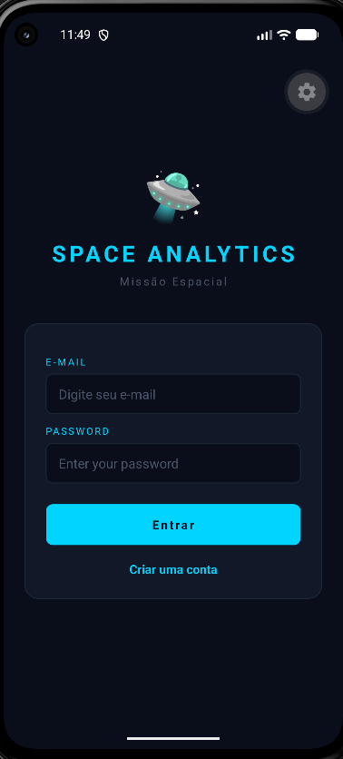
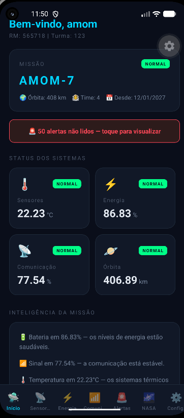
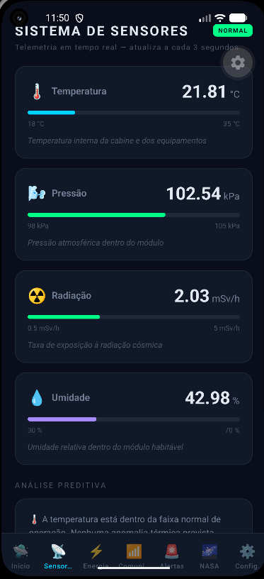
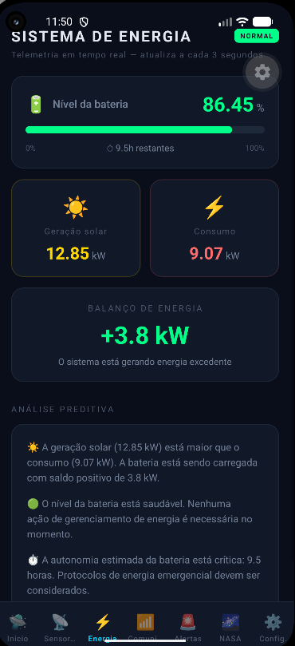
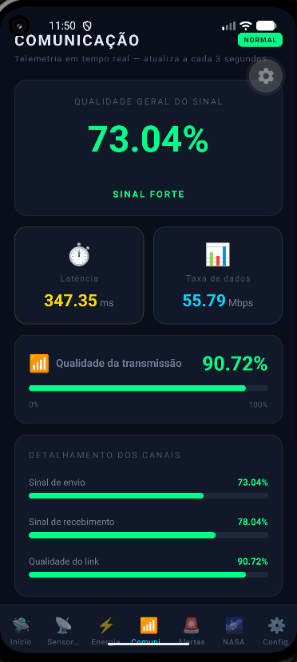
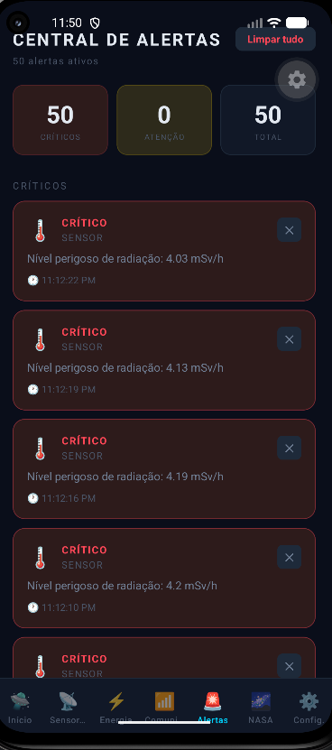
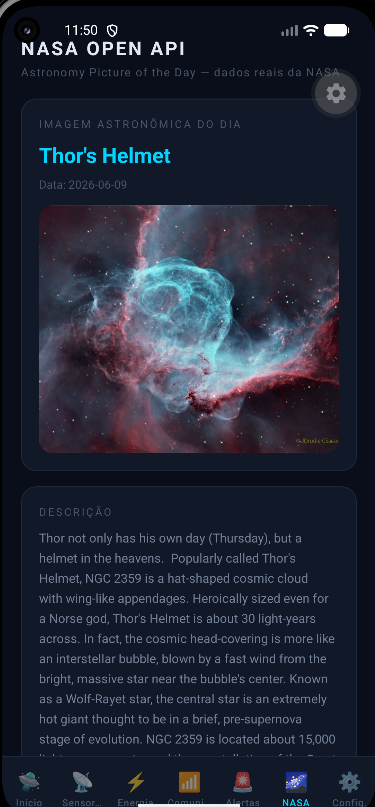
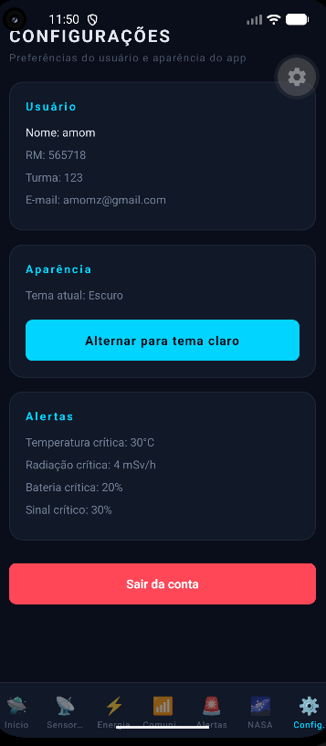
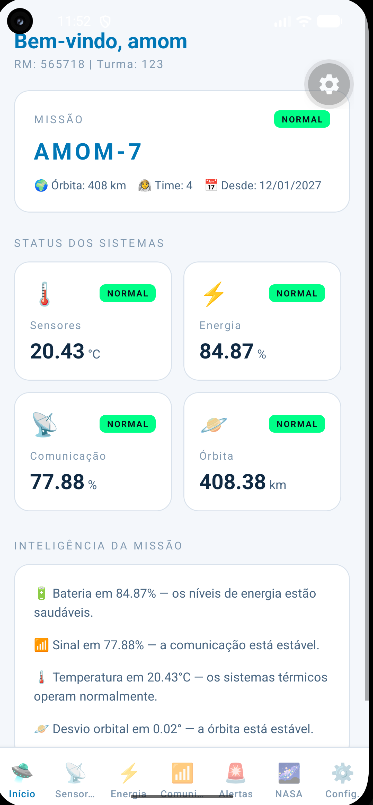

# Space Predictive Analytics

### Global Solution 2026.1 — Cross-Platform Application Development | FIAP


## Descrição

O **Space Predictive Analytics** é um aplicativo mobile desenvolvido em React Native com Expo para simular o monitoramento inteligente de uma missão espacial. A solução apresenta dashboards com dados simulados de sensores, energia, comunicação e estabilidade orbital, além de alertas automáticos baseados em limites críticos. Como diferencial, o app também possui modo claro/escuro, persistência local com AsyncStorage e integração com a NASA Open API para exibir dados astronômicos reais.

## Equipe

| Nome                   | RM       |
| -------------          | -------- |
| Amom Ianaguivara Brito | RM565718 |
| Fernanto Antônio       | RM562549 |
| Victor Chen            | RM565363 |

## Telas do Aplicativo

### Login



Tela inicial de autenticação do usuário, permitindo o acesso ao aplicativo por meio de e-mail e senha cadastrados.

### Cadastro


Formulário de cadastro com nome, turma, RM, e-mail, senha e confirmação de senha, incluindo validações dos campos preenchidos.

### Home — Dashboard Principal



Visão geral da missão espacial simulada, exibindo nome da missão, data de início, altitude orbital, tripulação e resumo dos principais sistemas monitorados.

### Dashboard de Sensores



Dashboard com dados simulados de sensores ambientais, incluindo temperatura, pressão, radiação e umidade, além de análise preditiva sobre possíveis riscos.

### Dashboard de Energia



Indicadores do sistema de energia da missão, mostrando nível da bateria, geração solar, consumo, autonomia estimada e balanço energético.

### Dashboard de Comunicação



Monitoramento do sistema de comunicação, incluindo intensidade do sinal, latência, taxa de dados e qualidade da transmissão.

### Alertas



Central de alertas gerados automaticamente com base nos dados simulados da missão, organizados por nível de criticidade.

### NASA Open API



Tela integrada com a NASA Open API, exibindo a imagem astronômica do dia, título, data e descrição oficial retornada pela API.

### Configurações



Tela de configurações do aplicativo, exibindo dados do usuário, preferências da aplicação, modo claro/escuro e opção de sair da conta.

### Modo Claro



Exemplo da interface utilizando o tema claro, demonstrando a personalização visual do aplicativo.

## Funcionalidades

* [x] Dashboard principal com resumo da missão espacial simulada
* [x] Dashboard de sensores com dados em tempo real simulado
* [x] Dashboard de energia com nível de bateria, geração solar e consumo
* [x] Dashboard de comunicação com sinal, latência e taxa de dados
* [x] Sistema de alertas automáticos por limiar crítico
* [x] Interpretação inteligente dos dados monitorados
* [x] Análises preditivas para apoio à tomada de decisão
* [x] Login e cadastro de usuário com validação
* [x] Persistência de sessão, usuário, alertas e preferências com AsyncStorage
* [x] Navegação com Expo Router usando Tabs e rotas de autenticação
* [x] Context API para gerenciamento de estado global
* [x] Alternância entre modo claro e modo escuro
* [x] Integração com NASA Open API

## Tecnologias

* React Native
* Expo
* Expo Router
* JavaScript
* Context API
* AsyncStorage
* NASA Open API
* React Hooks: useState e useEffect

## Como Executar

### Pré-requisitos

* Node.js instalado
* Expo Go instalado no celular ou emulador Android/iOS configurado
* Git instalado na máquina

### Instalação

Clone o repositório:

```bash
git clone https://github.com/seu-usuario/seu-repo.git
```

Acesse a pasta do projeto:

```bash
cd SpacePredictiveAnalytics
```

Instale as dependências:

```bash
npm install
```

Inicie o projeto:

```bash
npx expo start
```

Após iniciar o projeto, escaneie o QR Code com o aplicativo Expo Go ou pressione `a` no terminal para abrir no emulador Android.

## Vídeo de Demonstração

[Clique aqui para assistir à demonstração](https://youtube.com/...)

## Licença

Este projeto foi desenvolvido para fins acadêmicos — FIAP 2026.
